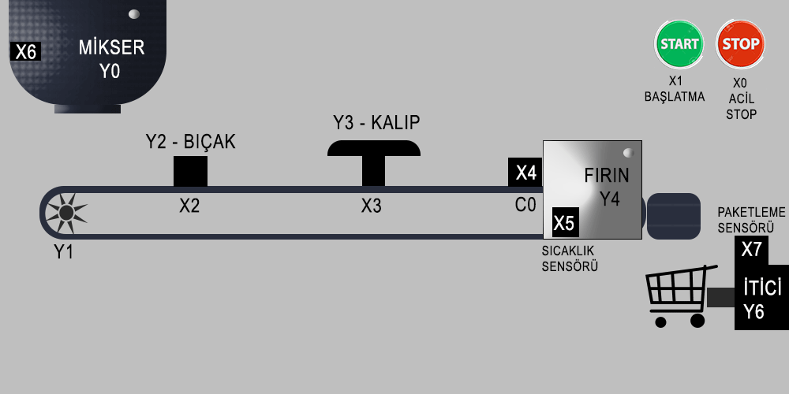
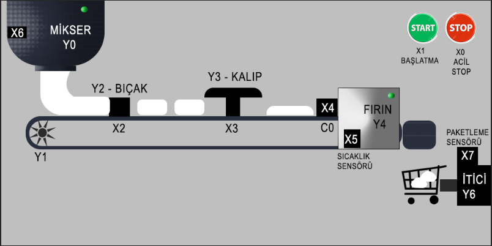
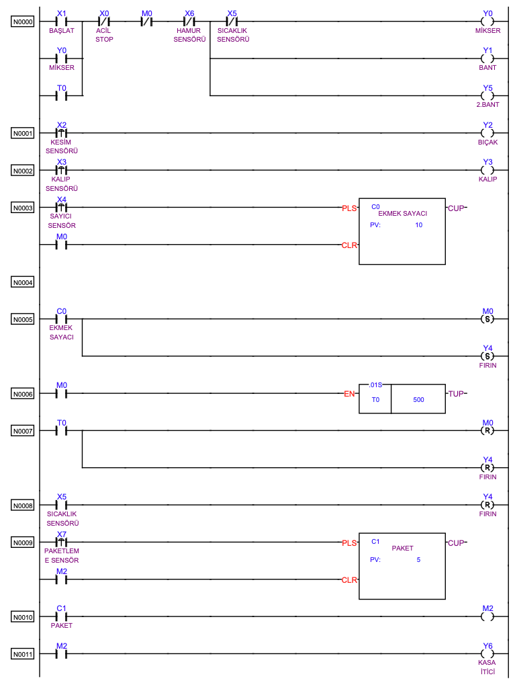

# Ekmek Fabrikası Otomasyonu - Fatek PLC Projesi

Bu proje, 2019 yılında geliştirdiğim bir ekmek fabrikası otomasyonu simülasyonudur. Projede **Fatek FBS14MA PLC** kullanılmıştır.

Aşağıda sistemin çalışma simülasyonunu görebilirsiniz:

## Projenin Amacı ve Senaryosu

Proje, bir ekmek üretim hattının temel adımlarını otomatikleştirmeyi amaçlamaktadır. Sistemin işleyiş senaryosu aşağıdaki gibidir:

* **Başlatma**: `START (X1)` butonuna basıldığında mikser (Y0), hamur taşıma bandı (Y1) ve fırın çıkış bandı (Y5) çalışmaya başlar.
* **Kesme ve Şekil Verme**: Hamur, `Kesim Sensörü (X2)` tarafından algılandığında `Bıçak (Y2)` ile kesilir. Ardından `Kalıp Sensörü (X3)` tarafından görüldüğünde `Kalıp (Y3)` ile ekmek şekli verilir.
* **Fırınlama**: `Sayıcı Sensör (X4)`, fırına (Y4) giren 10 adet hamuru sayar (C0 sayıcısı). Fırın dolar dolmaz bantlar ve mikser durur, fırın çalışır. Pişirme süresi `T0` zamanlayıcısı ile kontrol edilir. Süre sonunda fırın durur ve bantlar yeniden çalışır.
* **Paketleme**: Fırından çıkan ekmekler `Paketleme Sensörü (X7)` ile sayılır (C1 sayıcısı) ve her 5 ekmekte bir `İtici (Y6)` kasayı doldurur.
* **Güvenlik**: Sistemde bir `ACİL STOP (X0)` butonu ve fırını aşırı ısınmaya karşı koruyan bir `Sıcaklık Sensörü (X5)` bulunmaktadır.

## Sistem Mimarisi ve Ekipmanlar

Sistemdeki giriş ve çıkış elemanları aşağıda listelenmiştir.

**Girişler (Inputs):**
* `X0`: Acil Stop Butonu
* `X1`: Başlatma Butonu
* `X2`: Kesim Sensörü
* `X3`: Kalıp Sensörü
* `X4`: Fırın Girişi Sayım Sensörü
* `X5`: Fırın Sıcaklık Sensörü
* `X6`: Mikser Hamur Sensörü
* `X7`: Paketleme Sensörü

**Çıkışlar (Outputs):**
* `Y0`: Mikser
* `Y1`: Hamur Taşıma Bandı
* `Y2`: Bıçak
* `Y3`: Kalıp
* `Y4`: Fırın
* `Y5`: Çıkış Bandı
* `Y6`: Kasa İtici

### Sistem Genel Görünümü

## PLC Programı

Projenin otomasyon mantığı, Ladder Diyagramı (LD) kullanılarak programlanmıştır. Projenin orijinal kaynak koduna (`.pdw` uzantılı) ve Mnemonic kod listesine `src/` klasöründen ulaşabilirsiniz.

### Ladder Diyagramı

## Katkıda Bulunma

Bu proje, bir öğrenci projesi olarak geliştirilmiş olsa da her türlü katkıya ve geri bildirime açıktır. Eğer bir hata bulduysanız, programı geliştirecek bir fikriniz varsa veya dokümantasyonu iyileştirmek isterseniz lütfen çekinmeyin.

Katkıda bulunmak için:

1.  Bu depoyu "Fork" edin.
2.  Yeni bir "Branch" oluşturun (`git checkout -b ozellik/yeni-ekmek-turu`).
3.  Değişikliklerinizi yapın ve "Commit" edin (`git commit -m 'Yeni özellik: Tam buğdaylı ekmek modu eklendi'`).
4.  Oluşturduğunuz "Branch"i "Push" edin (`git push origin ozellik/yeni-ekmek-turu`).
5.  Bir "Pull Request" (PR) açarak değişikliklerinizi önerin.

Her türlü katkınız için şimdiden teşekkürler! 🥐